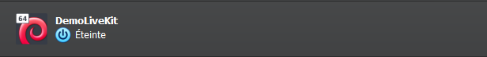
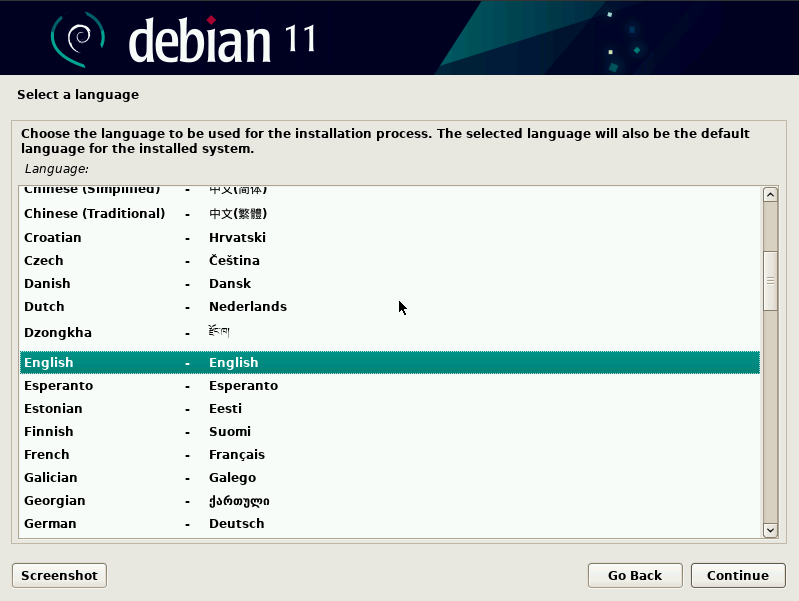
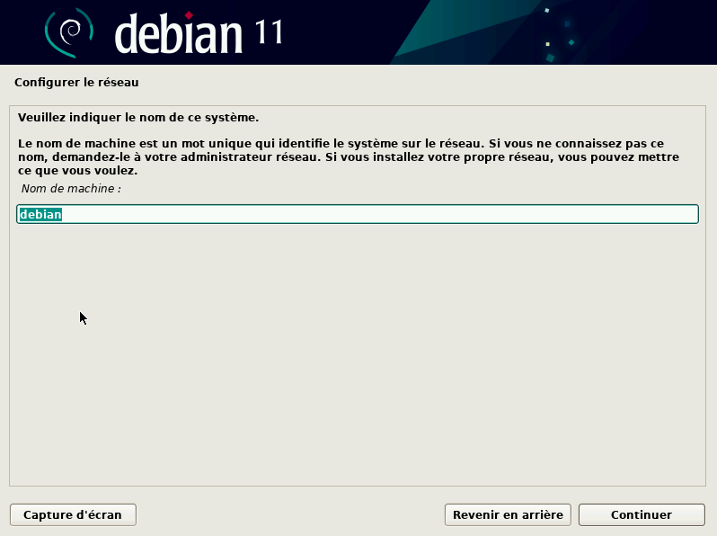
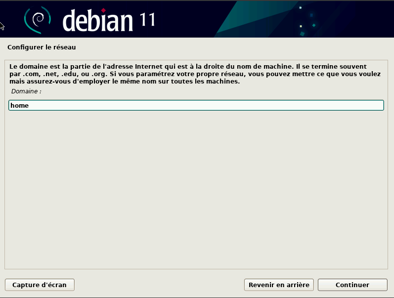
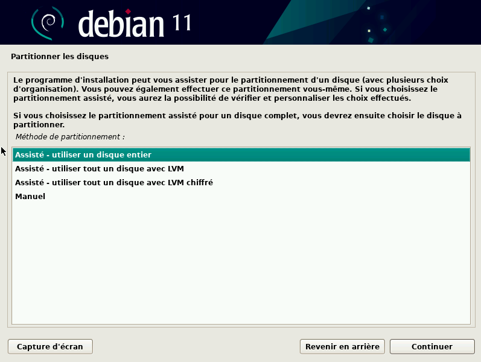
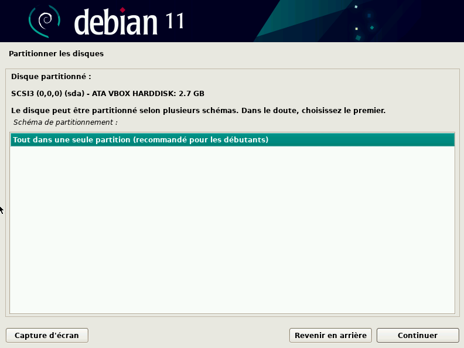
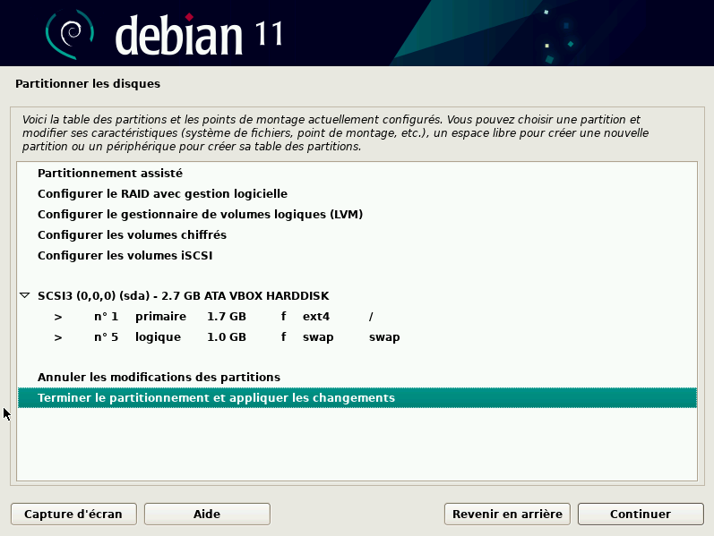

# Complete Debian Installation Guide

# Downloading the ISO

Download the Debian ISO from the official website: https://www.debian.org/distrib/netinst

# Create Debian VM on VirtualBox

Create a new virtual machine and boot from the previously downloaded Debian ISO.

# Install Debian

Follow the steps below to install Debian:

- Select _Graphical install_
  

- Select the language
  

- Enter the machine name
  

- For the domain name, enter _"home"_
  

- Set the root password

- Set the username

- Set the user password

- Select _"Guided - use entire disk and set up encrypted LVM"_ for partitioning
  

- Select _"All files in one partition"_
  

_It should look like this:_

- Apply the changes

- Finish the installation

_At the end, don't forget to add grub to your boot partition !_
