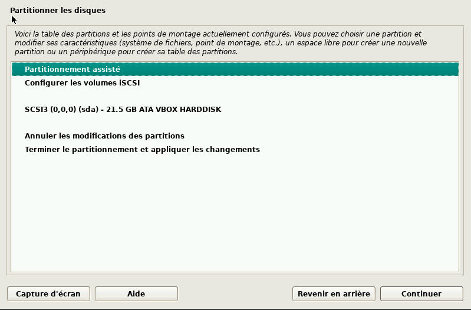
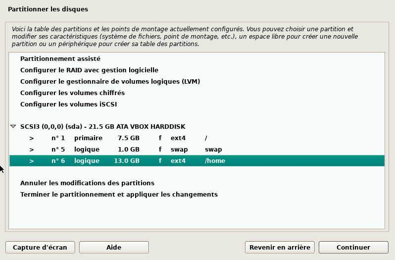
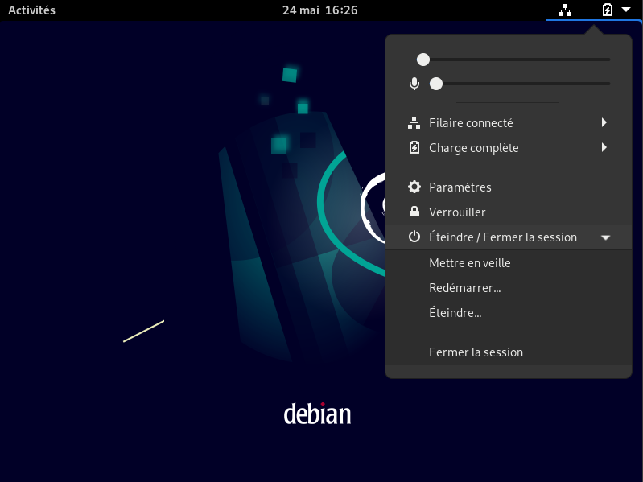
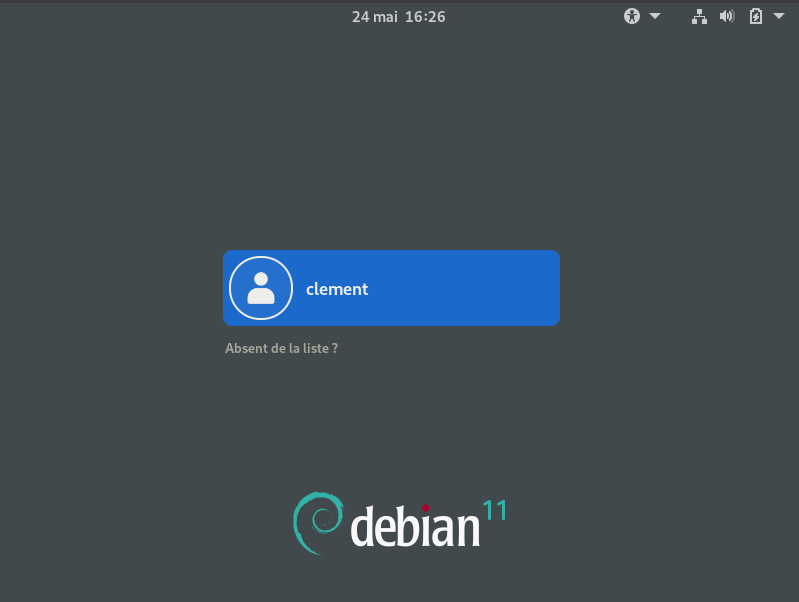
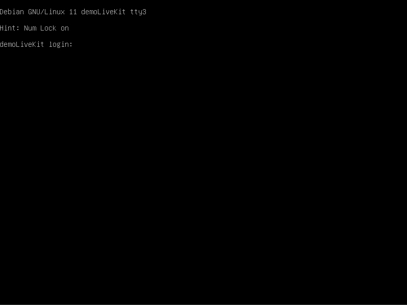

# Guide Installation Complète Custom Live Debian

# Sommaire

1. [installation de Debian](#installation-de-debian)

## Installation de Debian

### Téléchargement de l'ISO

Télécharger l'ISO de Debian depuis le site officiel : https://www.debian.org/distrib/netinst

### Installation de Debian sur VirtualBox

Créer une nouvelle machine virtuelle et démarrer sur l'ISO de Debian téléchargé précédemment.

Faire l'installation de Debian en suivant les étapes suivantes :

_Graphical install_

_Choisir la langue_

_Le nom de la machine_

_Pour le nom de domaine, mettre home_

_Choisir le mot de passe root_

_Choisir le nom d'utilisateur_

_Choisir le mot de passe de l'utilisateur_

_Choisir le partitionnement manuel_

_Choisir l'espace libre, puis créer une partition. Selectionnez Remplir l'espace de manière assitée, et choisissez /home sur une partition séparée._

_Appliquez les changements_

_Terminez l'installation_

## Preparation de l'OS

Créez un répertoire /a à la racine de votre système de fichier.

    sudo mkdir /a

Téléchargez l'archive du GitHub LiveLinux et décompressez la dans le répertoire /a.

    sudo wget https://github.com/Cassiopee-Bureau-Mobile/linux-live/archive/refs/heads/master.zip -P /a

    sudo unzip /a/master.zip -d /a

### Chiffrement de la partition /home

Tout d'abord pouvons donner à notre utilisateur les droits root mais cela n'est pas obligatoire.

    su
    /usr/sbin/usermod -aG sudo $USER
    exit
    reboot

Ensuite fermez la session si elle est ouverte.

Une fois sur ce menu faites Ctrl+Alt+F3 pour ouvrir un terminal.

Connectez vous en tant que root.

Executez ensuite le script de chiffrement de la partition /home.

    /a/linux-live-master/setup/encrypted_home.sh

Quittez le terminal avec Ctrl+Alt+F1.

Reconnectez-vous avec votre utilisateur (et changer le clavier si besoin avec la commande '''setxkbmap fr''' par exemple).

### Installation des paquets

Installez tous les paquets que vous souhaitez avoir sur votre système.

Changer le système comme vous le voulez.

**Important :** Importez bien votre client OpenVPN !

## Configuration de la clé USB

Branchez la clé USB et connectez la à votre VM.

Executer le build en renseignant le device de la clé USB.

    sudo /a/linux-live-master/build.sh /dev/sdX

FIN !
